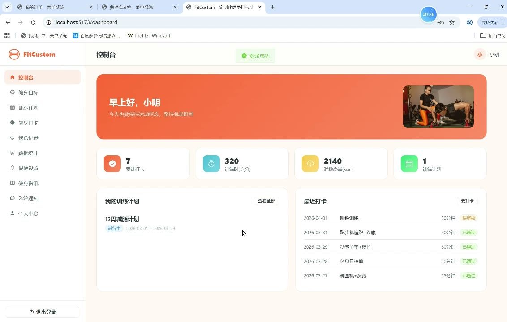
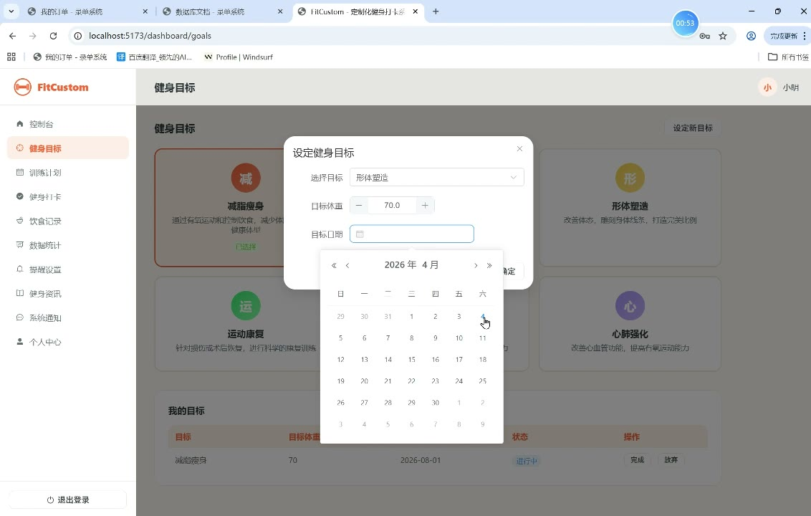
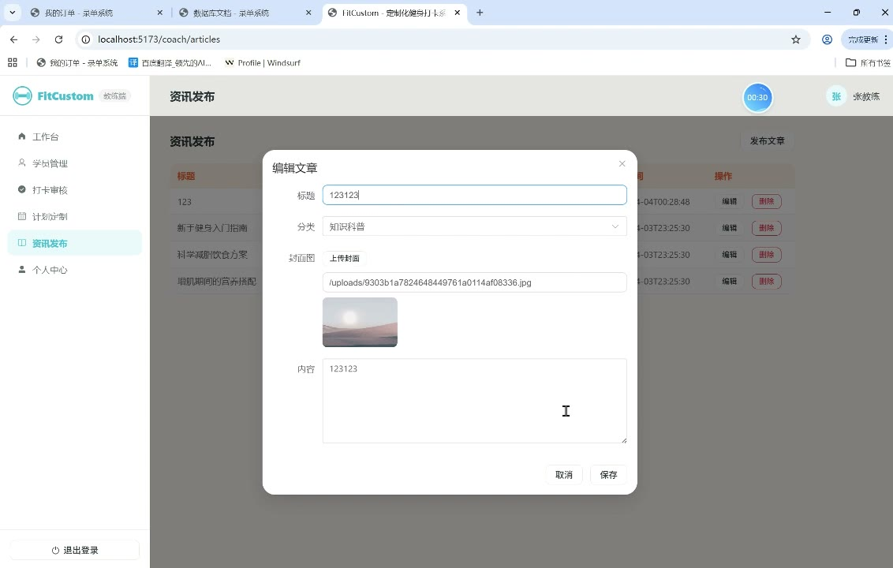
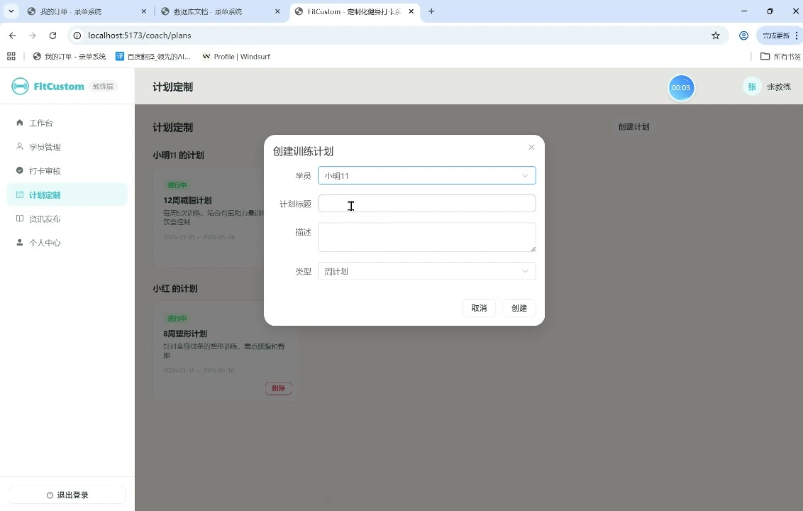
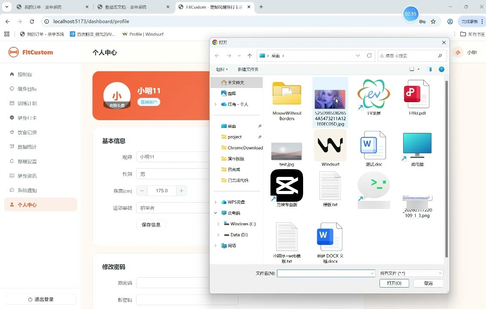

# (附文档)Springboot3+Vue3+MySQL 针对多目标的定制化健身打卡系统

**技术栈**：Springboot3、Vue3、MySQL

### 系统简介

FitCustom 是一款基于 Spring Boot 3 + Vue 3 + MySQL 的定制化健身打卡系统，采用前后端分离架构。系统支持普通用户、健身教练、系统管理员三种角色，涵盖健身目标设定、训练计划定制、每日打卡记录、饮食与体重追踪、教练审核指导、系统通知公告等完整功能闭环，帮助用户科学管理健身全过程。
 
### 核心功能
 
### 普通用户端

 
- 注册与登录：通过用户名/密码注册新账号，登录后获取 JWT Token 并跳转至用户工作台。 
- 个人信息管理：编辑昵称、手机号、性别、年龄、身高、体重、运动基础、头像等个人资料。 
- 修改密码：输入原密码与新密码完成密码更新，需校验原密码正确性。 
- 健身目标管理：查看系统预设的健身目标列表（如减脂、增肌等），选择并添加个人目标，设定目标体重与目标日期。 
- 健身计划查看：查看教练为自己制定的训练计划列表，点击计划可查看该计划下的每日训练项目明细（星期、动作名称、组数、次数、时长、重量等）。 
- 每日打卡：记录每次训练打卡，填写训练日期、动作名称、时长、组数、重量、消耗卡路里、训练感受、备注，并可上传图片。 
- 打卡记录查询：按时间倒序查看自己的打卡记录列表，支持分页浏览。 
- 饮食记录管理：按日期记录三餐饮食，填写食物名称、卡路里、蛋白质/碳水/脂肪含量，支持按日期筛选与删除记录。 
- 体重记录管理：记录每日体重与体脂率，以时间升序展示历史体重变化曲线。 
- 提醒管理：添加健身/喝水/休息等类型的提醒，设置提醒时间与启用状态，支持编辑与删除。 
- 健身资讯浏览：查看教练发布的公开文章（知识科普、动作教程、饮食建议），点击文章详情自动增加阅读量。 
- 系统通知查看：查看管理员发布的所有已启用的系统公告。 
- 个人统计概览：查看总打卡次数、累计训练时长、累计消耗卡路里、体重记录列表等个人数据。
 
### 教练端

 
- 学员管理：查看所有绑定自己的普通学员列表，点击可查看学员详情（个人信息、已选目标、体重记录）。 
- 打卡审核：查看自己学员的全部打卡记录，按待审核/已通过/未通过状态筛选，对打卡记录进行审核并填写审核意见。 
- 训练计划管理：为指定学员创建训练计划，填写计划标题、描述、计划类型、关联目标，支持编辑与删除计划。 
- 计划项目配置：为训练计划添加每日训练项目，指定星期几、动作名称、组数、次数、时长、重量、消耗卡路里，支持删除项目。 
- 文章管理：发布、编辑、删除自己的健身文章（支持分类：知识科普/动作教程/饮食建议），文章列表分页展示。 
- 教练端数据统计：查看自己管理的学员总数、学员总打卡数、待审核打卡数、已发布文章数。 
- 个人信息编辑：修改自己的个人资料（同用户端个人信息管理）。
 
### 管理员端

 
- 用户管理：按角色（USER/COACH/ADMIN）和关键词搜索用户，查看用户列表，支持新增用户、编辑用户信息、启用/禁用用户、删除用户。 
- 教练管理：查看所有教练用户列表，支持分页浏览。 
- 健身目标管理：新增、编辑、删除系统预设的健身目标，目标支持排序与启用状态控制。 
- 打卡管理：查看全平台所有用户的打卡记录列表，支持删除违规打卡记录。 
- 通知公告管理：发布系统通知（标题、内容、类型），支持编辑、删除、启用/禁用公告。 
- 操作日志管理：查看系统操作日志列表（用户ID、用户名、操作、方法、IP、时间），支持分页浏览。 
- 数据统计看板：查看平台总用户数、教练数、打卡总数、文章数、今日活跃用户数，近7天每日打卡趋势图，各健身目标选择人数分布。
 
### 技术栈

 后端框架Spring Boot 3.x ORMMyBatis-Plus 权限认证Spring Security + JWT 前端框架Vue 3 (Composition API) 状态管理Pinia 前端路由Vue Router 4 (Hash 模式) UI 组件库Element Plus 构建工具Vite 数据库MySQL 8.x HTTP 客户端Axios
 
### 交付内容

 
- 后端完整源码 
- 前端完整源码 
- 数据库初始化脚本 
- 万字文档

## 界面展示

---

## 获取完整源码 + 万字文档

本仓库为项目介绍页。**完整前后端源码、数据库初始化脚本、万字项目文档**，请加微信 `kangkangcode`，或访问 [codekk.top](http://codekk.top) 获取。

可作课程设计 / 毕业设计参考，支持远程部署调试。